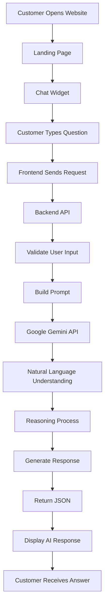

# KopiBot System Flow

```mermaid
flowchart TD

A[Customer Opens Website]
-->B[Landing Page]

B-->C[Chat Widget]

C-->D[Customer Types Question]

D-->E[Frontend Sends Request]

E-->F[Backend API]

F-->G[Validate User Input]

G-->H[Build Prompt]

H-->I[Google Gemini API]

I-->J[Natural Language Understanding]

J-->K[Reasoning Process]

K-->L[Generate Response]

L-->M[Return JSON]

M-->N[Display AI Response]

N-->O[Customer Receives Answer]
```